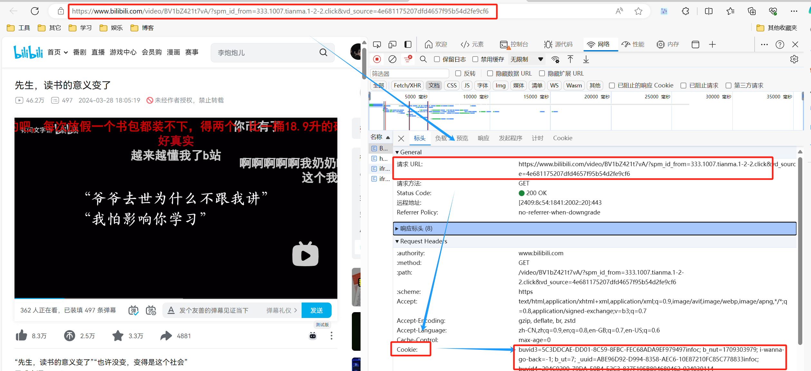
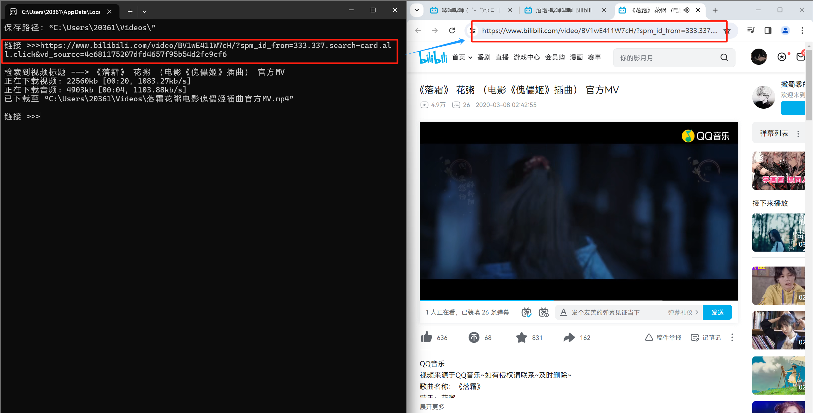

## B站视频破解
- 能够下载绝大部分普通用户视频
- 解析最高清晰度画质
- 需要手动获取*Cookie*
- 依赖*ffmpeg*

## 1、 配置文件
```json
{
    "folder_path": "C:\\Users\\Crazysand\\Videos\\", 
    "ffmpeg_path": ".\\ffmpeg\\bin\\ffmpeg.exe",
    "only_audio": false,
    "cookie": ""
}
```
- **`folder_path`**：保存音视频的文件夹路径（Windows系统以`\\`结尾）
- **`ffmpeg_path`**：[*ffmpeg.exe*的路径](#3、下载*ffmpeg*)
- **`only_audio`**：是否仅下载音频
	1. `true`：下载音频
    2. `false`：下载视频
-  **`cookie`**：[用户的Cookie](#2、抓取Cookie) 

## 2、抓取Cookie



1. 按下**F12**抓包，类型选择**文档**
2. 找到**请求URL**与**网站视频URL**一致的数据包
3. 复制其*Cookie*

4. 把复制好的*Cookie*粘贴到*config.json*中的*cookie*项中

## 3、下载*ffmpeg*

1. [下载链接](https://github.com/BtbN/FFmpeg-Builds/releases) 
2. 把*ffmpeg*资源包放在脚本所在目录
3. 把*bin*目录下的*ffmpeg.exe*的路径拷贝到*config.json*里

## 4、安装python依赖包

在当前路径打开终端命令行，执行一下命令

```
pip install -r requirement.txt
```

## 5、运行脚本

双击运行脚本，复制B站视频链接到命令行


